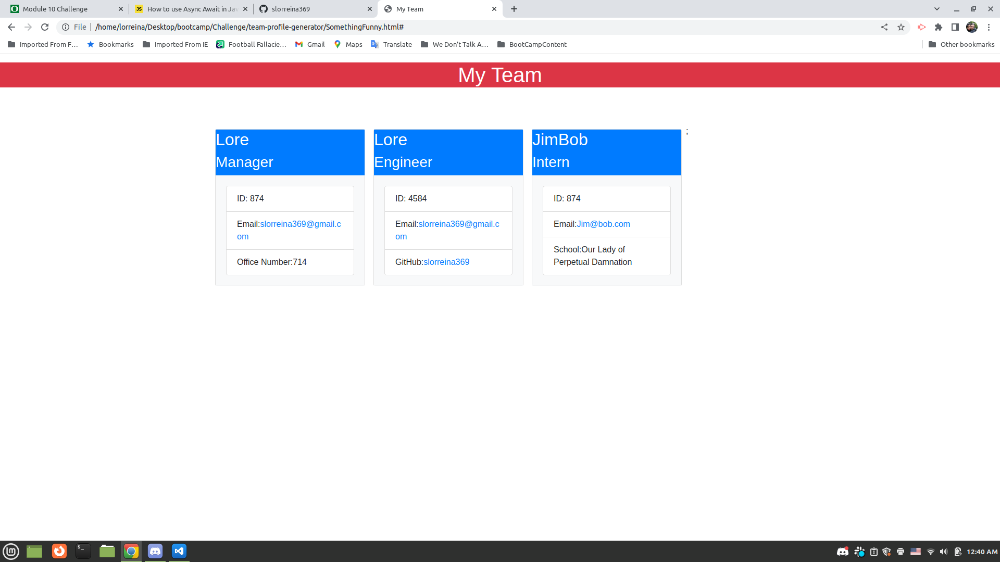

# team-profile-generator

## Description
A README wizard that allows for someone to answer a few simple questions and creates a professional grade README.md file for future use.

## Table of Contents
* [Installation](#Installation)
* [Usage](#Usage)
* [License](#License)
* [Tests](#Tests)
* [Questions](#Questions)

## Installation
Install node and install the needed dependencies with npm
Install Jest for testng purposes

## Usage
Run 'node index' in the command line

## Visuals
# Images

# Screenshot

## Video
Screen Recording

## Contributing
Me

## Questions
If you have additional questions, please reach me at slorreina369@gmail.com or slorreina369 on GitHub.

THANK YOU FOR YOUR TIME